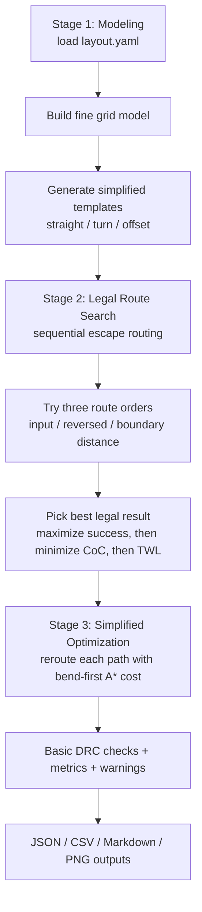

# QEDA-Router

QEDA-Router is a learning/demo Python project for simplified superconducting quantum chip routing. It is inspired by research directions such as automatic routing for superconducting quantum chip layout design, but it does **not** reproduce a full paper algorithm, does **not** use a real PDK, and must **not** be used directly for fabrication or tape-out.

The current MVP focuses on a transparent teaching workflow:

- model a toy chip routing problem from `layout.yaml`
- build a fine-grid routing space
- generate simplified routing templates
- search legal escape routes sequentially
- try a small local A* optimization step
- run basic DRC-style checks
- export metrics, warnings, and a preview figure

## Three-Stage Workflow



The template model in this repository is a **simplified discrete template model**. It approximates routing behavior on a grid and does not implement accurate curved CPW geometry.

## Quick Start

```bash
python -m pip install -e .[dev]
qeda-router validate --layout examples/4qubit/layout.yaml
qeda-router route --layout examples/4qubit/layout.yaml --out outputs/4qubit
qeda-router demo --out outputs/demo
```

## `layout.yaml` Input Format

```yaml
chip:
  width: 1000
  height: 1000
  grid_size: 10
process:
  d1: 40
  d2: 80
  db: 20
  r: 50
escape_edges:
  left: true
  right: true
  top: true
  bottom: true
obstacles:
  - name: resonator_1
    type: rectangle
    x: 400
    y: 420
    width: 120
    height: 40
control_starts:
  - name: c_q1
    x: 450
    y: 500
readout_starts:
  - name: r_q1
    x: 500
    y: 460
```

Fields:

- `chip`: toy chip size and routing grid
- `process`: simplified spacing and turning parameters
- `escape_edges`: which chip boundaries can be used as escape targets
- `obstacles`: toy rectangular keep-out regions
- `control_starts` / `readout_starts`: line start anchors

## CLI Examples

```bash
qeda-router validate --layout examples/4qubit/layout.yaml
qeda-router route --layout examples/4qubit/layout.yaml --out outputs/4qubit
qeda-router demo --out outputs/demo
```

## Output Files

Each routing run writes:

- `routed_layout.json`: full route result, chosen sequence, metrics, and warnings
- `route_summary.csv`: per-route summary table
- `drc_report.json`: basic DRC-style warnings
- `report.md`: human-readable run report
- `layout_preview.png`: simple matplotlib preview

Warnings are intentionally preserved. Successful routing does **not** imply the result is physically valid for fabrication.

## 4-Qubit Toy Demo

The repository includes a toy `examples/4qubit/layout.yaml` file with a small chip boundary, a few obstacle rectangles, and a handful of control/readout starts. It is intentionally small and synthetic so the routing behavior stays readable for study and debugging.

Run:

```bash
qeda-router demo --out outputs/demo
```

## Current Implemented Features

- layout loading and validation from YAML
- fine-grid occupancy model
- simplified routing templates: `straight`, `turn`, `offset`
- sequential single-side escape routing
- three-order sequence search
- bend-first local A* optimization on legal routes
- basic DRC-style checks:
  - out-of-bound points
  - obstacle collision
  - route spacing warnings
- metrics:
  - CoC (corner count)
  - TWL (total wire length)
- JSON / CSV / Markdown / PNG outputs

## Planned Features

- accurate curved CPW geometry
- full combination routing template geometry
- tree-search line ordering
- blocking table
- route-swap operation for readout lines
- spatially constrained iterative optimization
- lazy open set
- multi-layer routing
- GDS export
- KLayout integration
- Qiskit Metal/KQCircuits integration

## Development With AI Coding Assistance

This project was developed with AI coding assistance. The AI helped scaffold code, tests, and documentation, but the routing logic, modeling assumptions, DRC interpretation, and any future engineering decisions still require human review. This repository is intentionally framed as a learning/demo project rather than a production EDA tool.


